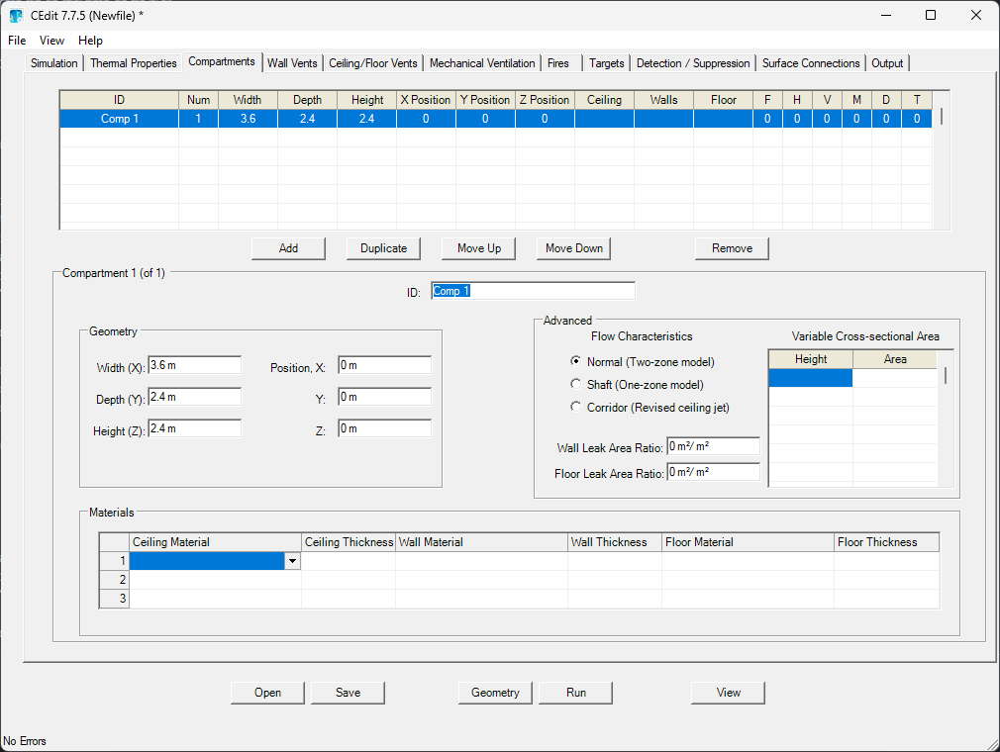

# PyCFAST

[](https://github.com/bewygs/pycfast/actions/workflows/test.yml)
[](https://pycfast.org/index.html)
[](https://results.pre-commit.ci/latest/github/bewygs/pycfast/main)
[](https://github.com/astral-sh/uv)
[](https://github.com/astral-sh/ruff)
[](https://github.com/python/mypy)
[](https://pypi.org/project/pycfast/)
[](https://codecov.io/gh/bewygs/pycfast)
[](https://github.com/bewygs/pycfast/blob/main/LICENSE)
[](https://doi.org/10.5281/zenodo.18703351)


**PyCFAST** is a Python interface for the [**Consolidated Fire and Smoke Transport (CFAST)**](https://pages.nist.gov/cfast/) fire simulation software. Its primary goal is to **automate CFAST calculations at scale**, run parametric studies, sensitivity analyses, data generation, or optimization loops that would be impractical through the graphical interface (CEdit). It also provides a convenient way to create CFAST input files, execute simulations, and analyze results using the versatility and extensive ecosystem of Python.

## From CEdit GUI to Python

PyCFAST can be seen as an alternative to the CFAST graphical interface, CEdit. It exposes Python objects that integrate naturally into your Python workflow. Instead of relying on modifying input files through the GUI, you define and manipulate CFAST models programmatically.

<table>
<tr>
<td align="center"><strong>CEdit (GUI)</strong></td>
<td align="center"><strong>PyCFAST (Python)</strong></td>
</tr>
<tr>
<td></td>
<td>

```python
from pycfast import Compartment

room = Compartment(
    id="Comp 1",
    width=10.0,
    depth=10.0,
    height=10.0,
    ceiling_mat_id="Gypboard",
    wall_mat_id="Gypboard",
    floor_mat_id="Gypboard",
)

```

</td>
</tr>
</table>


## Example Usage

This minimal model runs with just a title and one compartment with default values:

```python
from pycfast import CFASTModel, Compartment, SimulationEnvironment

model = CFASTModel(
    simulation_environment=SimulationEnvironment(title="My Simulation"),
    compartments=[Compartment()],
    # you can also add: fires, wall_vents, ceiling_floor_vents, mechanical_vents, ...
    file_name="my_simulation.in",
)
model.summary()
model.save()
```

For a full model with all components:

```python
from pycfast import (
    CeilingFloorVent,
    CFASTModel,
    Compartment,
    Fire,
    Material,
    MechanicalVent,
    SimulationEnvironment,
    WallVent,
)

model = CFASTModel(
    simulation_environment=SimulationEnvironment(...),
    material_properties=[Material(...)],
    compartments=[Compartment(...)],
    wall_vents=[WallVent(...)],
    ceiling_floor_vents=[CeilingFloorVent(...)],
    mechanical_vents=[MechanicalVent(...)],
    fires=[Fire(...)],
    file_name="test_simulation.in",
)
```

Or you can import your existing model from a CFAST input file:

```python
from pycfast.parsers import parse_cfast_file

model = parse_cfast_file("existing_model.in")
```

Then you can run the model and obtain results as pandas DataFrames:

```python
results = model.run()
# results is a dict of pandas DataFrames
# Available keys: compartments, devices, masses, vents, walls, zones

results["compartments"].head()
#   Time    ULT_1   LLT_1   HGT_1  VOL_1  PRS_1  ...
# 0  0.0    20.00   20.00    5.00   0.01    0.0   ...
# 1  1.0    20.83   20.00    5.00   0.10    0.0   ...

results["devices"].head()
#   Time  TRGGAST_1  TRGSURT_1  TRGINT_1  TRGFLXI_1  ...
# 0  0.0      20.0       20.0      20.0       0.0    ...
# 1  1.0      20.0       20.0      20.0       0.38   ...
```


**Note:** When importing an existing model, ensure that all component names (such as TITLE, MATERIAL, ID, etc.) use **only alphanumeric characters**. Avoid **special characters** like quotes and slashes, as these may cause parsing issues and will be automatically sanitized where possible.

You can also inspect the model interactively on Jupyter or VS Code, or use text-based methods:

```python
model             # interactive HTML card in Jupyter/VS Code
model.summary()   # text summary to stdout
model.save()      # writes the CFAST input file to disk
model.view_cfast_input_file()  # view the generated input file
```

With this library you can easily obtain a similar data generation workflow as below:

https://github.com/user-attachments/assets/359045a2-4645-4e95-a788-55bb6aff4b6c

Check out the [examples](https://pycfast.org/examples.html) for more usage scenarios.

## Installation

PyCFAST requires **Python 3.10 or later**. It is fully [tested on verification input file](https://github.com/bewygs/pycfast/tree/main/tests/verification_tests) from CFAST version **7.7.0** to version **7.7.5**.

### Pip or Conda

PyCFAST can be installed from [PyPI](https://pypi.org/project/pycfast) or [conda-forge](https://anaconda.org/conda-forge/pycfast):

```bash
pip install pycfast
```

```bash
conda install -c conda-forge pycfast
```

### Source

To install PyCFAST from source, clone the repository and install the required dependencies:

```bash
git clone https://github.com/bewygs/pycfast.git
cd pycfast
python -m pip install .
```

### CFAST Installation

Download and install CFAST from the [NIST CFAST website](https://pages.nist.gov/cfast/) or the [CFAST GitHub repository](https://github.com/firemodels/cfast). Follow the installation instructions for your operating system and ensure `cfast` is available in your PATH. If CFAST is installed in a non-standard location, you can manually specify the path with these methods :

- From an environment variable ``CFAST``:

    ```bash
    export CFAST="/path/to/your/cfast/executable"  # Linux/MacOS
    set CFAST="C:\path\to\your\cfast\executable"  # Windows (cmd)
    $env:CFAST="C:\path\to\your\cfast\executable"  # Windows (PowerShell)
    ```

- From Python code when defining the ``CFASTModel``:

    ```python
    import pycfast

    # set custom CFAST executable path via environment variable
    import os
    os.environ['CFAST'] = "/path/to/your/cfast/executable"

    # Or directly when defining CFASTModel
    model = pycfast.CFASTModel(cfast_path="/path/to/your/cfast/executable")
    ```

## Documentation

Full documentation, including the API reference and examples, is available online: [PyCFAST Documentation](https://pycfast.org/index.html)

## Contributing

We welcome contributions! Please see our [Contributing Guide](CONTRIBUTING.md) for more information.

## References

If you use PyCFAST in your projects, please consider citing the following:

```bib
@software{wygas_2026_pycfast,
  author    = {Wygas, Benoît},
  title     = {PyCFAST},
  year      = {2026},
  publisher = {Zenodo},
  doi       = {10.5281/zenodo.18703351},
  url       = {https://doi.org/10.5281/zenodo.18703351}
}
```

## Acknowledgments

This Python package was developed with the support of [**Orano**](https://www.orano.group/).

<a href="https://www.orano.group/">
  <picture>
    <source media="(prefers-color-scheme: dark)" srcset="docs/source/_static/orano-logo-dark.svg">
    
  </picture>
</a>

PyCFAST is built on top of the work of the CFAST development team at the [National Institute of Standards and Technology (NIST)](https://www.nist.gov/). We acknowledge their ongoing efforts in maintaining and improving the CFAST fire modeling software.
