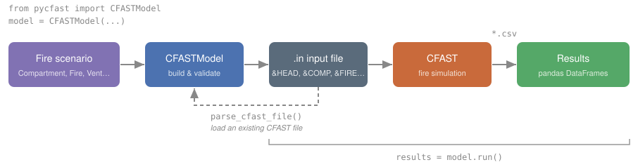

.. PyCFAST documentation master file, created by
   sphinx-quickstart on Sat Aug  2 15:23:05 2025.
   You can adapt this file completely to your liking, but it should at least
   contain the root `toctree` directive.

Welcome to the PyCFAST documentation
====================================

PyCFAST is a Python interface for the |CFAST Page|_ fire simulation software,
providing an easy-to-use Python programming interface for building and running fire
scenarios. It allows researchers and engineers to automate CFAST runs, build and modify
input files programmatically, execute simulations, and analyze results using the
broader Python ecosystem.

.. |CFAST Page| replace:: **Consolidated Fire and Smoke Transport (CFAST)**
.. _CFAST Page: https://pages.nist.gov/cfast/

Motivation
==========

CFAST is a long-established fire modeling software written in Fortran and traditionally
run through its graphical interface (CEdit). This reliance on a GUI can make large
parametric studies, automation, and reproducibility cumbersome.

PyCFAST was originally developed internally at `Orano <https://www.orano.group/>`_ to
integrate CFAST with the Python scientific ecosystem (notably for the
|scipy.optimize|_ module), and complements existing tools like |CData|_ by
exposing every CFAST component programmatically. Below is a 
diagram of how the components of PyCFAST interact with the CFAST model:

You describe a fire scenario with Python objects (:class:`~pycfast.Compartment`,
:class:`~pycfast.Fire`, :class:`~pycfast.WallVent`, :class:`~pycfast.Device`…),
assemble them into a :class:`~pycfast.CFASTModel`, and launch the simulation with
:meth:`~pycfast.CFASTModel.run`. You can also start from an existing ``.in`` file with
:func:`~pycfast.parsers.parse_cfast_file`.

Quickstart
==========

Below is a minimal example to create a model, run it, and obtain results of the
compartment as a pandas DataFrame:

.. code-block:: python

    from pycfast import CFASTModel, Compartment, SimulationEnvironment

    model = CFASTModel(
        simulation_environment=SimulationEnvironment(title="My Simulation"),
        compartments=[Compartment(id="ROOM1", width=5.0, depth=4.0, height=2.7)],
        file_name="my_simulation.in",
    )

    results = model.run()

:meth:`~pycfast.CFASTModel.run` returns a dictionary of pandas
:class:`~pandas.DataFrame`, one per output CSV file:

.. code-block:: pycon

    >>> list(results)
    ['compartments', 'devices', 'masses', 'vents', 'walls', 'zone']

    >>> results["compartments"]
       Time   ULT_1  LLT_1  HGT_1  VOL_1  PRS_1  ...
    0   0.0   20.00  20.00   5.00   0.01    0.0  ...
    1   1.0   20.83  20.00   5.00   0.10    0.0  ...

More details on how to use PyCFAST are available in the
:doc:`Getting Started <getting_started>` guide or the :doc:`Examples <examples>`
section, which includes more complex use cases.

.. |scipy.optimize| replace:: ``scipy.optimize``
.. _scipy.optimize: https://docs.scipy.org/doc/scipy/reference/optimize.html

.. |CData| replace:: **CData**
.. _CData: https://www.nist.gov/publications/cfast-consolidated-fire-and-smoke-transport-version-7-volume-5-cfast-fire-data

.. toctree::
   :maxdepth: 1
   :caption: User Guide

   Installation <installation>
   Getting Started <getting_started>
   Examples <examples>

.. toctree::
   :maxdepth: 2
   :caption: Reference

   API <api/index>

.. toctree::
   :maxdepth: 1
   :caption: Development

   Contributing Guide <contributing>
   Changelog <changelog>

.. toctree::
   :maxdepth: 1
   :caption: Other

   Acknowledgments <acknowledgments>
   License <license>
   Citation <citation>