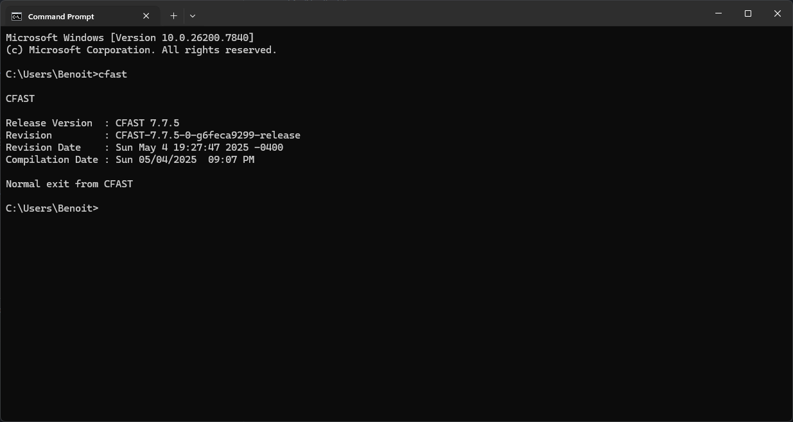

Installation
============

PyCFAST requires **Python 3.10 or later**. It fully supports CFAST version from **7.7.0**
to version **7.7.5**.

Pip
---

PyCFAST can be installed from `PyPI <https://pypi.org/project/pycfast>`_:

.. code-block:: bash

    pip install pycfast

Conda
-----

PyCFAST can also be installed from the `conda-forge <https://anaconda.org/conda-forge/pycfast>`_ channel:

.. code-block:: bash

    conda install -c conda-forge pycfast

Source
------

To install the latest development version of PyCFAST, clone the repository and install the required dependencies:

.. code-block:: bash

    git clone https://github.com/bewygs/pycfast.git
    cd pycfast
    python -m pip install .

CFAST Installation
------------------

Download and install CFAST from the `NIST CFAST downloads page <https://pages.nist.gov/cfast/downloads.html>`_ or
the `CFAST GitHub repository <https://github.com/firemodels/cfast/releases>`_. Follow the installation
instructions for your operating system and ensure ``cfast`` is available in your PATH. On Windows go into
command prompt and type ``cfast`` to check if it is recognized as a command. You should see the CFAST version information.

If CFAST is installed in a non-standard location, you can manually specify the path
with these methods from an environment variable named ``CFAST``:

.. tab-set::

   .. tab-item:: Linux/macOS
      :sync: linux

      .. code-block:: bash

         export CFAST="/path/to/your/cfast/executable"

   .. tab-item:: Windows (cmd)
      :sync: windows-cmd

      .. code-block:: bat

         set CFAST="C:\path\to\your\cfast\executable"

   .. tab-item:: Windows (PowerShell)
      :sync: windows-ps

      .. code-block:: powershell

         $env:CFAST = "C:\path\to\your\cfast\executable"

Or you can set the environment variable from Python code:

.. code-block:: python

    import os

    os.environ['CFAST'] = "/path/to/your/cfast/executable"

Or when defining the :class:`~pycfast.CFASTModel` directly:

.. code-block:: python
    
    from pycfast import CFASTModel

    model = CFASTModel(
            ...,
            cfast_exe="/path/to/your/cfast/executable"
        )
